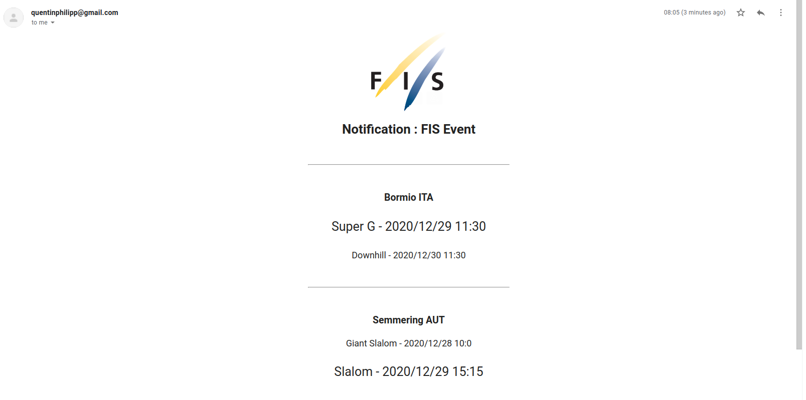

# FIS-Result-scrapper
Scrape FIS results with Selenium. School Project for University of Ljubljana

## Presentation

This tool scrape the website of the FIS (International Ski Federation) to get all the possible data from every competitions and display the data in a simple graphical interface made with Qt.
It can also send a notification when an event is live.

## Project report
[Project report](Project_report.pdf)

## Demo

### GUI for the data

### Live notification

